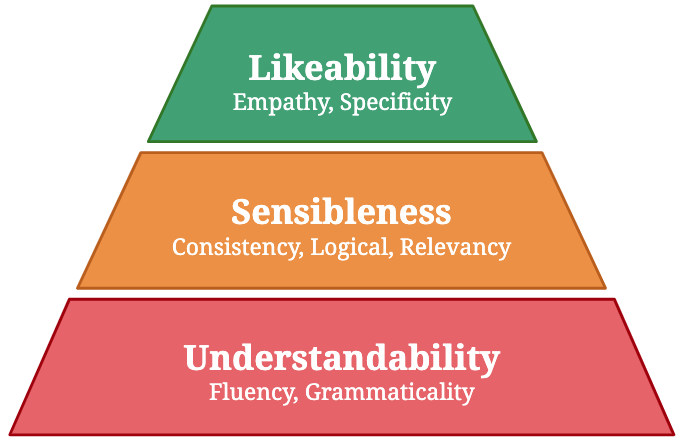

# Configuration Dialogue Evaluation Metric

This repository contains codes of evaluation metrics used in "[Deconstruct to Reconstruct a Configurable Evaluation Metric for Open-Domain Dialogue Systems](https://arxiv.org/abs/2011.00483)" paper.

## Metric
- **Distinct-n**: measures the ratio of unique n-gram tokens to all generated n-gram tokens in every response.
- **Valid Utterance Prediction** (VUP): Measure how valid a response is.
- **Next Utterance Prediction** (NUP): Score measuring how well a response is suitable to the context.
- **Negative Log-Likelihood** (MLM-NLL): Measure generic/specific aspect of a response.
- **USL-H**: Evaluate the overall quality of a response by merging `VUP`, `NUP`, and `MLM-NLL` together using a hierarchy concept.
- **Other Masked Language Model**: MLM-PPL, MLM-NCE

## Concept
We usually can observe multiple aspects in a response. The following examples are responses to the context `That sounds fine. What time shall we meet at the bus stop?` with 3 aspects:
- **Understandability**: Can we understand the response?
- **Sensibleness**: Does the response make sense to the context?
- **Specificity**: Does the response contain specific information?

| System | Response | Underst. | Sensible  | Specific  |
|---|---|---|---|---|
| A | Any time is fine.  |  1 | 1 | 0  |
| B | I don’t want to be party pooper, but I’m gonna have to ask you to leave. | 1| 0 | 1  |

If we end up evaluating dialogue system `A` and `B`, based only on the number, it is difficult to decide which one is better. If we have a few more aspects, it will be even more difficult.

So, the core idea to fix this problem is to structure them hierarchically based on their importance. The lower the hierarchy, the more important that aspect is. If the lower hierarchy fails, do not consider the remaining. Based on this concept, the USL-H combines these scores simply as `U + U*S + U*S*L`.

<p align="center">
    <br>
</p>

The reasons behind this structure are because:
1. A response first need to be understandable
2. It needs to make sense to the context even though it is boring.

These two points are like the minimum requirements of a response. There is no need to consider the rest if these two fails. Thus, the remaining qualities are just **extra toppings** to make responses more interesting in a certain way.


## Setup
Run this command to install the required dependencies
```
pip install -r requirements.txt
python setup.py install
```

## Pre-Trained Models
Click [here](https://drive.google.com/file/d/1Kinwz0o473X_FVY6TmGAVRRGDXBo4CSO/view?usp=sharing) for link to the pre-trained weights of VUP, NUP, MLM metric trained on [DailyDialog](https://arxiv.org/abs/1710.03957) dataset. Download the weight and unzip the files into a directory.

## Human Annotation Data
[Here](https://drive.google.com/file/d/15eBr-q3r9mag78gKK_MwLMILtLf2gVtn/view?usp=sharing) is the data we use to evaluate our metrics.


## Usage

### Dataset
There are two input files for a training set. One is for contexts and another is their corresponding responses. Each of these files should contain only a single context or response per line. When working with multi-turn context, concatenating the contexts into a single line will do the trick.

### Training

There are three metrics to train `VUP, NUP, MLM`. `train-ctx-path` and `valid-ctx-path` are only required for training `NUP` metric.

Run this command to train a metric
```
CUDA_VISIBLE_DEVICES=0 python train.py \
--metric NUP \
--train-ctx-path datasets/dailydialog/dailydialog_train_ctx.txt \
--train-res-path datasets/dailydialog/dailydialog_train_res.txt \
--valid-ctx-path datasets/dailydialog/dailydialog_valid_ctx.txt \
--valid-res-path datasets/dailydialog/dailydialog_valid_res.txt \
--batch-size 16 \
--max-epochs 2 \
--ctx-token-len 100 \
--res-token-len 25
```

### Normalization
`(MLM-) NLL, NCE, PPL` are not between 0 and 1, which is biased when merging with other metrics. Thus, we run the following command on `training` or `validation` set to get the necessary values for minmax normalizatioÂn.

```
python normalize.py \
--weight-path PATH_TO_THE_WEIGHT \
--data-path path_to_the_train_or_valid_set
```

### Prediction

Rename the weights of each models into `BERT-VUP.ckpt`, `BERT-NUP.ckpt`, and `BERT-MLM.ckpt`. Copy these files and `mlm_minmax_score.json` into the same directory.

```
python predict.py \
--weight-dir path_to_directory_of_all_weights \
--context-file path_to_ctx_file \
--response-file path_to_res_file
```


## License


This project is licensed under the MIT License - see the [LICENSE](LICENSE) file for details.
Please include a link to this repo if you use it in your work and consider citing the following paper:

```
@inproceedings{phy-etal-2020-deconstruct,
    title = "Deconstruct to Reconstruct a Configurable Evaluation Metric for Open-Domain Dialogue Systems",
    author = "Phy, Vitou and Zhao, Yang and Aizawa, Akiko",
    booktitle = "Proceedings of the 28th International Conference on Computational Linguistics",
    month = dec,
    year = "2020",
    address = "Barcelona, Spain (Online)",
    publisher = "International Committee on Computational Linguistics",
    url = "https://www.aclweb.org/anthology/2020.coling-main.368",
    pages = "4164--4178"
}
```
